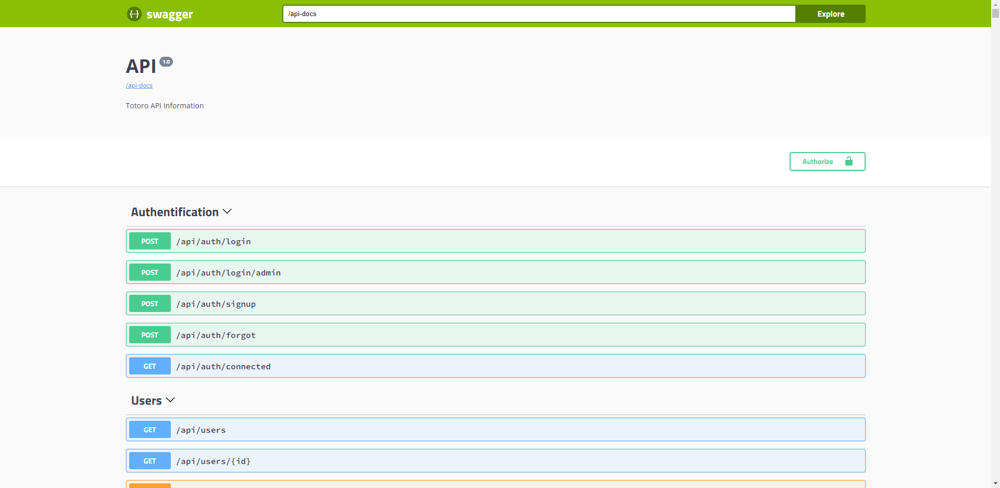

Swagger est un langage de description d'interface permettant de décrire des API RESTful exprimées à l'aide de JSON. Swagger est utilisé avec toute une série d'outils logiciels open source pour concevoir, créer, documenter et utiliser des services Web RESTful. `(ref.wikipédia)`

## Demo

https://api-totoro.herokuapp.com/docs

